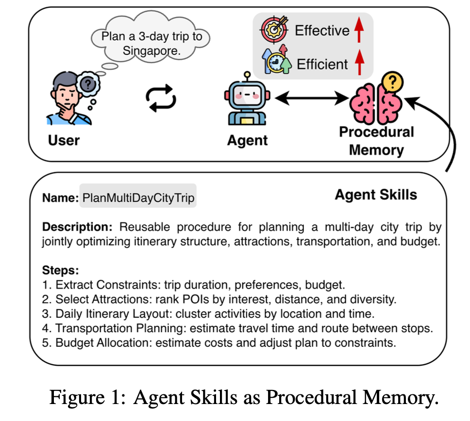
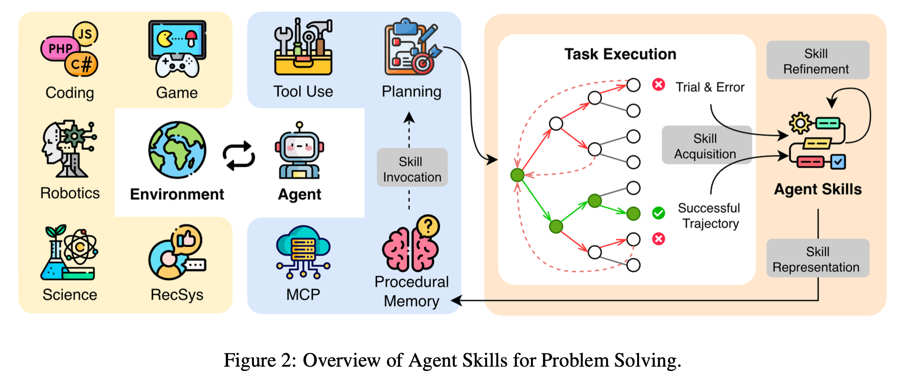

# Agent Skills Survey

## Agent Skills from the Perspective of Procedural Memory: A Survey

<p align="center">
  <a href="https://www.techrxiv.org/doi/pdf/10.36227/techrxiv.176857932.25697838">📄 Paper</a> |
  <a href="https://github.com/yashonwu/agent-skills-survey">🔗 GitHub</a> |
  <a href="https://yashonwu.github.io/agent-skills-survey/">🌐 Project</a>
</p>

As large language model (LLM)-powered autonomous agents increasingly demonstrate strong capabilities in complex real-world tasks, recent research has focused on leveraging skills to endow these agents with domain-specific expertise and adaptive competence. In this survey, we present the first systematic overview of LLM-powered Agent Skills from the perspective of procedural memory, conceptualizing skills as a core form of procedural knowledge that enables agents to internalize, retain, and reuse task-solving procedures through interaction and experience. We comprehensively examine what Agent Skills are, why they are essential for agentic intelligence, and how they can be effectively acquired, represented, invoked, and refined within LLM-based systems. Furthermore, we review representative applications across diverse domains and discuss key challenges and future opportunities in developing and generalizing Agent Skills.

Key Words: Agent Skills, Agentic AI, LLM Agents, Procedural Memory

## Agent Skills for Problem Solving

<p align="center">
  
  
</p>

<p align="center"><em>Figure: Agent Skills for Problem Solving.</em></p>

- **Skill Acquisition:** Through repeated task interactions, agents convert recurring action patterns into reusable skills that encode experience-driven procedural knowledge.
- **Skill Representation:** Skills are stored as modular, discoverable units of procedural memory with lightweight metadata, exposing details only when needed.
- **Skill Invocation:** When a task fits a skill's scope, the agent retrieves and executes that skill (or related tools) to run complex workflows reliably.
- **Skill Refinement:** Skills are continuously updated from outcomes and feedback to fix errors, improve efficiency, and adapt to new contexts.


## Anthropic Agent Skills


*Figure: A systematic implementation of Anthropic Agent Skills, illustrating skill organization, progressive
disclosure, and runtime invocation.*

## Agent Skills Implementation

| Method | Acquisition | Representation | Invocation | Refinement | Resource Link |
| --- | --- | --- | --- | --- | --- |
| [Agent Skills](https://www.anthropic.com/engineering/equipping-agents-for-the-real-world-with-agent-skills) | Manual | File+Code | Match | Static | [GitHub](https://github.com/agentskills/agentskills) |
| [Voyager](https://arxiv.org/abs/2305.16291) | Exploration | Program | Retrieve | Self-Reflection | [Website](https://voyager.minedojo.org/) |
| [SkillAct](https://openreview.net/pdf?id=6LG3cIRrF4) | Demonstration | Prompt | Plan | Static | - |
| [ASD](https://arxiv.org/pdf/2405.15019) | Task Proposal | Policy | Plan+Chain | RL | [GitHub](https://github.com/xf-zhao/Agentic-Skill-Discovery) |
| [CASCADE](https://arxiv.org/abs/2512.23880) | Puzzle Solving | Program | Retrieve | Self-Reflection | [GitHub](https://github.com/CederGroupHub/CASCADE) |
| [SAGE](https://arxiv.org/abs/2512.17102) | Task Solving | Program | Retrieve | RL | - |
| [PolySkill](https://arxiv.org/abs/2510.15863) | Self-Exploration | Program | Call+Chain | Continual Learning | - |
| [ASI](https://arxiv.org/abs/2504.06821) | Task Solving | Program | Call | Update | [GitHub](https://github.com/zorazrw/agent-skill-induction) |
| [SkillWeaver](https://arxiv.org/abs/2504.07079) | Exploration | API | Call | Collective | [GitHub](https://github.com/OSU-NLP-Group/SkillWeaver) |
| [EXIF](https://arxiv.org/abs/2506.04287) | Exploration | Trajectory | - | Iterative Feedback | - |
| [PAE](https://arxiv.org/abs/2412.13194) | Task Proposal | Trajectory | - | RL | [GitHub](https://github.com/amazon-science/PAE) |
| [Bottom-Up Agent](https://arxiv.org/abs/2505.17673) | Exploration | Trajectory | Plan | Update | [GitHub](https://github.com/AngusDujw/Bottom-Up-Agent) |
| [TAIRA](https://arxiv.org/abs/2506.23485) | Distillation | Thought Pattern | Retrieve | Reflection | [GitHub](https://github.com/Alcein/TAIRA) |
| [`Mem^p`](https://arxiv.org/abs/2508.06433) | Distillation | Memory | Retrieve | Update | - |
| [CER](https://arxiv.org/abs/2506.06698) | Distillation | Memory | Retrieve | Update | - |
| [ReMe](https://arxiv.org/abs/2512.10696) | Distillation | Memory | Retrieve | Reflection | [GitHub](https://github.com/agentscope-ai/ReMe) |
| [LEGOMem](https://arxiv.org/abs/2510.04851) | Distillation | Memory | Retrieve | Collective | - |

*Table: Summarization of representative Agent Skills implementations.*


## Agent Applications with Agent Skills

| Domain | Method |
| --- | --- |
| Household | [SkillAct](https://openreview.net/pdf?id=6LG3cIRrF4), [`Mem^p`](https://arxiv.org/abs/2508.06433) |
| Robotics | [ASD](https://arxiv.org/pdf/2405.15019) |
| Science | [CASCADE](https://arxiv.org/abs/2512.23880) |
| Coding | [OpenAI Codex](https://developers.openai.com/codex/skills), [Cursor](https://cursor.com/docs/context/skills), [Claude Code](https://code.claude.com/docs/en/skills), [GitHub Copilot](https://docs.github.com/en/copilot/concepts/agents/about-agent-skills), [VS Code](https://code.visualstudio.com/docs/copilot/customization/agent-skills), [SAGE](https://arxiv.org/abs/2512.17102), [ReMe](https://arxiv.org/abs/2512.10696) |
| Web | [PolySkill](https://arxiv.org/abs/2510.15863), [ASI](https://arxiv.org/abs/2504.06821), [SkillWeaver](https://arxiv.org/abs/2504.07079), [EXIF](https://arxiv.org/abs/2506.04287), [PAE](https://arxiv.org/abs/2412.13194), [CER](https://arxiv.org/abs/2506.06698) |
| Game | [EXIF](https://arxiv.org/abs/2506.04287), [Bottom-Up Agent](https://arxiv.org/abs/2505.17673), [Voyager](https://arxiv.org/abs/2305.16291) |
| RecSys | [TAIRA](https://arxiv.org/abs/2506.23485) |
| Travel | [`Mem^p`](https://arxiv.org/abs/2508.06433) |
| Office | [LEGOMem](https://arxiv.org/abs/2510.04851) |

*Table: Agent Applications with Agent Skills.*


## Citation

```latex
@article{wu2026agent,
  title={Agent Skills from the Perspective of Procedural Memory: A Survey},
  author={Wu, Yaxiong and Zhang, Yongyue},
  journal={Authorea Preprints},
  year={2026},
  publisher={Authorea}
}
```
